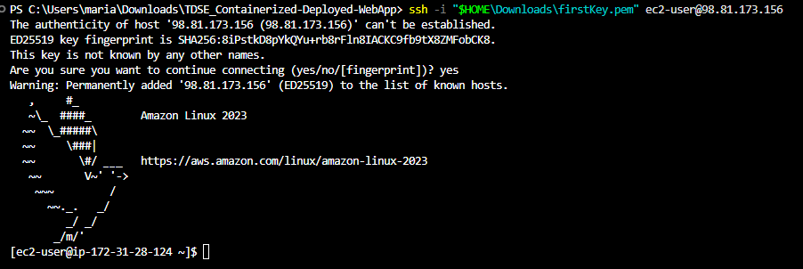
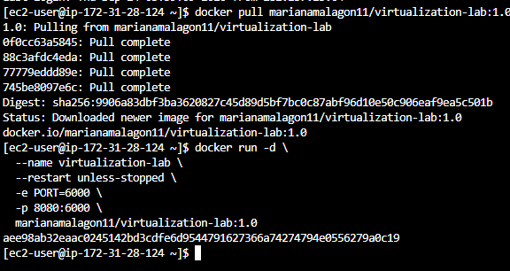
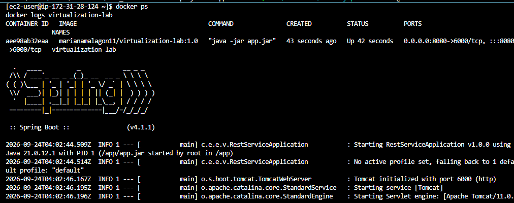
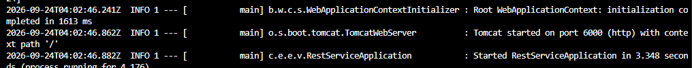
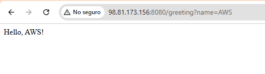
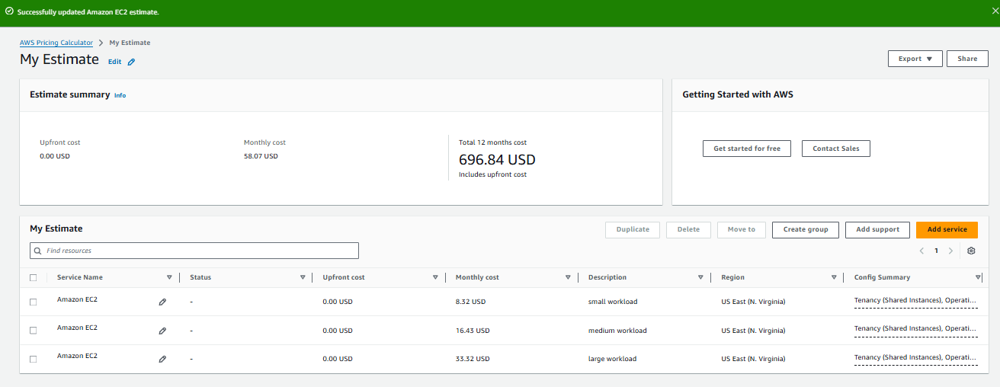
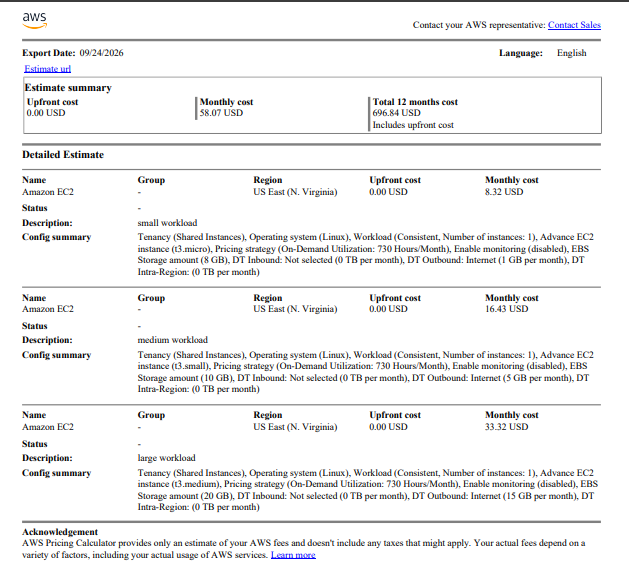

# TDSE Containerized & Deployed Web App

Mariana Malagón

## Purpose

This project explores virtualization as an architectural mechanism for modularity, isolation, portability, and deployment. It implements a small Java web application built with Spring Boot, packaged as a Docker image, run locally in isolated containers, published to Docker Hub, and deployed on an Amazon EC2 virtual machine.

## Technology stack

- Java 21 LTS
- Maven 3.9+
- Spring Boot 4.1.1
- Docker Desktop with Docker Compose v2
- Docker Hub
- Amazon Linux 2023 on AWS EC2
- Amazon Corretto 21 container image

## Part 1: Web application

A minimal REST web application built with Spring Boot.

**Endpoint:** `GET /greeting?name={name}`, returns `Hello, {name}!` (defaults to `World` if no `name` is provided).

**Environment-based configuration:** the application reads its listening port from the `PORT` environment variable. This is handled in `RestServiceApplication` via `application.setDefaultProperties(...)`, which sets `server.port` before the Spring context starts. The instructor confirmed that the exact default port number is not important, as long as the application correctly reads it from the `PORT` environment variable, so this project was verified using `PORT=7000`.

### Project structure

```
src/main/java/co/edu/escuelaing/virtualizationlab/
├── RestServiceApplication.java   # Application entry point; reads PORT env var
└── HelloRestController.java      # REST controller exposing /greeting
```

### Build and run locally

```bash
mvn clean package
java -jar target/*.jar
```

To run it with the `PORT` environment variable set to `7000`:

```powershell
# Windows PowerShell (wildcards aren't expanded, so use the exact jar name)
$env:PORT=7000
java -jar target/virtualization-lab-1.0.0.jar
```

```bash
# Linux/macOS
PORT=7000 java -jar target/*.jar
```

### Verify

```
http://localhost:7000/greeting?name=Mari
```

Expected response:

```
Hello, Mari!
```

### Evidence

Local execution with the `PORT` environment variable set to `7000`, confirming both the endpoint logic and the environment-based port configuration:


This was tested locally: the app reads the `PORT` environment variable (verified with `PORT=7000`), and the `/greeting` endpoint responds correctly with both a provided `name` and the `World` default.

## Part 2: Docker image and containers

The application is packaged into a Docker image based on `amazoncorretto:21` (see [Dockerfile](Dockerfile)).

### Build the image

```bash
mvn clean package
docker build -t marianamalagon11/virtualization-lab:1.0 .
```


Verify the image was created:

```bash
docker images
```


### Run a container

```bash
docker run -d --name virtualization-lab-1 -e PORT=6000 -p 34000:6000 marianamalagon11/virtualization-lab:1.0
```


The container maps host port `34000` to the container's internal port `6000`, and its logs confirm Spring Boot started successfully.


### Demonstrating container isolation

Two additional containers were started from the same image on different host ports. They run independently of each other and of `virtualization-lab-1`, proving that Docker gives each instance its own isolated process and network space on the same host:

```bash
docker run -d --name virtualization-lab-2 -p 34001:6000 marianamalagon11/virtualization-lab:1.0
docker run -d --name virtualization-lab-3 -p 34002:6000 marianamalagon11/virtualization-lab:1.0
```


Each container was verified independently and responded with its own name parameter, confirming they are fully isolated instances:

```
http://localhost:34000/greeting?name=Container   -> Hello, Container!
http://localhost:34001/greeting?name=Container2  -> Hello, Container2!
http://localhost:34002/greeting?name=Container3  -> Hello, Container3!
```


## Part 3: Multi-container environment with Docker Compose

Docker Compose defines and runs the application environment with two services on the same Docker network: the Spring Boot app (`web`) and a MongoDB database (`db`). The application does not persist data in MongoDB yet. The `db` service exists to show how Compose manages multiple services, networking, port mappings, and persistent volumes (see [compose.yaml](compose.yaml)).

The `web` service is built from the local `Dockerfile`, and the `db` service uses the official `mongo:8` image. The `web` container can reach MongoDB through the hostname `db`, which is the Compose service name, since Compose creates the internal network automatically. Two named volumes (`mongodb`, `mongodb_config`) preserve MongoDB's data independently of the container lifecycle.

### Build and start both services

```bash
docker compose up -d --build
```


### Verify both containers are running

```bash
docker compose ps
```


### Inspect the logs

```bash
docker compose logs web
```


```bash
docker compose logs db
```


### Verify the web application

```
http://localhost:8087/greeting?name=Compose
```


### Connect to MongoDB directly

To confirm the `db` service works independently of the application, connect to its shell and run a few basic operations:

```bash
docker compose exec db mongosh
```

```
show dbs
use workshop
db.messages.insertOne({ message: "Hello from Docker Compose" })
db.messages.find()
exit
```


The document was inserted and retrieved successfully, confirming that MongoDB is running and reachable inside its own container.

### Stopping the environment

```bash
docker compose down      # stops and removes containers, keeps the volumes (data is preserved)
docker compose down -v   # also removes the volumes (all MongoDB data is deleted)
```

## Part 4: Publish to Docker Hub

**Docker Hub repository:** [hub.docker.com/r/marianamalagon11/virtualization-lab](https://hub.docker.com/r/marianamalagon11/virtualization-lab)

Log in, tag the image as `latest` in addition to `1.0`, and push both tags:

```bash
docker login
docker tag marianamalagon11/virtualization-lab:1.0 marianamalagon11/virtualization-lab:latest
docker push marianamalagon11/virtualization-lab:1.0
docker push marianamalagon11/virtualization-lab:latest
```


The repository appears under the account with both tags:


## Part 5: Deploy on AWS EC2

**Instance:** Amazon Linux 2023, `t3.micro`, region `us-east-1` (N. Virginia).

**Security group:**
- SSH (port 22): restricted to the developer's public IP.
- Custom TCP (port 8080): open to allow testing the application from any network.

### Connect and install Docker

```bash
ssh -i firstKey.pem ec2-user@<ec2-public-ip>
```



```bash
sudo yum update -y
sudo yum install -y docker
sudo service docker start
sudo usermod -a -G docker ec2-user
```

After adding `ec2-user` to the `docker` group, the SSH session was closed and reopened so the new group membership takes effect.

### Pull and run the image

```bash
docker pull marianamalagon11/virtualization-lab:1.0

docker run -d \
  --name virtualization-lab \
  --restart unless-stopped \
  -e PORT=6000 \
  -p 8080:6000 \
  marianamalagon11/virtualization-lab:1.0
```



### Verify the deployment

```bash
docker ps
docker logs virtualization-lab
```





### Public deployment URL

```
http://<ec2-public-ip>:8080/greeting?name=AWS
```



The application responded `Hello, AWS!` from the public EC2 instance, confirming a successful cloud deployment.

Note: this project's EC2 instance does not use an Elastic IP, so its public IP can change if the instance is stopped and restarted. The IP shown above reflects the instance at the time of testing.

## Part 6: Deployment model and cost analysis

### Deployment model

```
Client
  | HTTP request
  v
EC2 virtual machine
  v
Docker Engine
  v
Java web application container
```

**Layer responsibilities:**

- **EC2 virtual machine:** isolated compute, memory, storage, and network resources rented by the hour.
- **Docker container:** a portable execution environment containing the application and its runtime dependencies.
- **Java web application:** receives HTTP requests and provides the business functionality (the `/greeting` endpoint).
- **Security group:** controls which inbound traffic can reach the virtual machine (in this deployment, SSH restricted to the developer's IP, and the application port open for testing).

### Workload assumptions

| | Small workload | Medium workload | Large workload |
|---|---|---|---|
| Monthly requests | 10,000 | 100,000 | 1,000,000 |
| AWS Region | US East (N. Virginia) | US East (N. Virginia) | US East (N. Virginia) |
| EC2 instance type | t3.micro | t3.small | t3.medium |
| Number of instances | 1 | 1 | 1 |
| Monthly runtime | 730 hours (continuous) | 730 hours (continuous) | 730 hours (continuous) |
| EBS storage | 8 GB gp3 | 10 GB gp3 | 20 GB gp3 |
| Estimated outbound data transfer | 1 GB | 5 GB | 15 GB |
| Avg. request/response size | Small (a few hundred bytes for this endpoint) | Small (a few hundred bytes) | Small (a few hundred bytes) |
| Runs continuously or scheduled | Continuously | Continuously | Continuously |
| Requires high availability | No | No | Not for this workload volume, though it is the scenario closest to justifying a second instance |

All three scenarios stay under the 100 GB/month free outbound data transfer allowance, so data transfer does not add cost in any of them.

### Cost estimate (AWS Pricing Calculator)





### Cost analysis table

| Scenario | Monthly requests | Monthly infrastructure cost | Estimated cost per request | Main cost drivers |
|---|---|---|---|---|
| Small workload | 10,000 | $8.32 | $0.000832 | EC2 runtime and storage |
| Medium workload | 100,000 | $16.43 | $0.0001643 | EC2 runtime and storage (larger instance) |
| Large workload | 1,000,000 | $33.32 | $0.0000333 | Instance capacity and storage |

Estimated cost per request = monthly infrastructure cost / monthly requests.

### Architectural discussion

**Why does an EC2-based deployment have a baseline monthly cost even when the application receives few requests?**

An EC2 instance is billed by the hour it is running, not by the number of requests it handles. Even with zero traffic, the instance still occupies compute, memory, and storage resources that AWS has reserved, so the bill only goes to zero if the instance is stopped. This is why the Small workload still costs over $8/month despite receiving only about 14 requests per day.

**At which workload level does the fixed cost become less significant per request?**

Looking at the cost-per-request column, it drops from $0.00083 (Small) to $0.0000333 (Large), a 25x reduction. The fixed cost of running the instance stays roughly constant (it grows a bit because a larger instance type is needed), while it gets divided across far more requests. The Large workload is where the fixed cost becomes negligible per request, since the infrastructure cost barely grows compared to the 100x increase in traffic.

**What would force you to move from one EC2 instance to multiple instances?**

Mainly two things: the instance running out of CPU, memory, or network capacity for the incoming traffic, and the need for fault tolerance (a single instance is a single point of failure, if it crashes or the underlying host has a problem, the application goes down completely). At very high or spiky traffic, or when uptime guarantees matter, a second instance behind a load balancer becomes necessary.

**Which additional services would a production deployment likely require?**

A load balancer to distribute traffic and provide failover across multiple instances, a managed database (such as Amazon RDS or DocumentDB, instead of running MongoDB in a container with no backups), CloudWatch for monitoring and alerting, automated EBS snapshots for backups, and a container registry such as Amazon ECR (instead of relying solely on Docker Hub) if the deployment moves toward an orchestrated environment like ECS or EKS.

**Would a serverless deployment be more cost-effective for the small-workload scenario?**

Likely yes, for this specific case. The small workload receives about 10,000 requests a month, roughly one request every four minutes on average, with the application idle almost all the time. A service like AWS Lambda only charges for the time spent actually processing a request, not for idle hours, so at this traffic level a serverless deployment would probably cost a fraction of the ~$8.32/month EC2 baseline, since there is no idle capacity to pay for. This advantage shrinks as traffic grows and the workload becomes more constant, which is why EC2 becomes more competitive at the Medium and Large workload levels.

### Conclusion

For the Large workload (1,000,000 requests/month), EC2 is an appropriate choice: traffic is high and steady enough that a continuously running instance is well utilized, and the cost per request is already very low ($0.0000333). For the Small workload, EC2 still works and is simple to reason about, but it carries a fixed cost that is mostly idle capacity, so a serverless approach would likely be more cost-effective at that specific volume.
