# TDSE Containerized & Deployed Web App

Mariana Malagón

## Purpose

This project explores virtualization as an architectural mechanism for modularity, isolation, portability, and deployment. It implements a small Java web application built with Spring Boot, packaged as a Docker image, run locally in isolated containers, published to Docker Hub, and deployed on an Amazon EC2 virtual machine.

## Technology stack

- Java 21 LTS
- Maven 3.9+
- Spring Boot 4.1.1
- Docker Desktop with Docker Compose v2
- Docker Hub
- Amazon Linux 2023 on AWS EC2
- Amazon Corretto 21 container image

## Part 1: Web application

A minimal REST web application built with Spring Boot.

**Endpoint:** `GET /greeting?name={name}`, returns `Hello, {name}!` (defaults to `World` if no `name` is provided).

**Environment-based configuration:** the application reads its listening port from the `PORT` environment variable. This is handled in `RestServiceApplication` via `application.setDefaultProperties(...)`, which sets `server.port` before the Spring context starts. The instructor confirmed that the exact default port number is not important, as long as the application correctly reads it from the `PORT` environment variable, so this project was verified using `PORT=7000`.

### Project structure

```
src/main/java/co/edu/escuelaing/virtualizationlab/
├── RestServiceApplication.java   # Application entry point; reads PORT env var
└── HelloRestController.java      # REST controller exposing /greeting
```

### Build and run locally

```bash
mvn clean package
java -jar target/*.jar
```

To run it with the `PORT` environment variable set to `7000`:

```powershell
# Windows PowerShell (wildcards aren't expanded, so use the exact jar name)
$env:PORT=7000
java -jar target/virtualization-lab-1.0.0.jar
```

```bash
# Linux/macOS
PORT=7000 java -jar target/*.jar
```

### Verify

```
http://localhost:7000/greeting?name=Mari
```

Expected response:

```
Hello, Mari!
```

### Evidence

Local execution with the `PORT` environment variable set to `7000`, confirming both the endpoint logic and the environment-based port configuration:

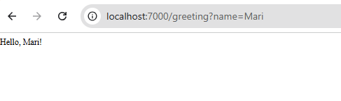

This was tested locally: the app reads the `PORT` environment variable (verified with `PORT=7000`), and the `/greeting` endpoint responds correctly with both a provided `name` and the `World` default.

## Part 2: Docker image and containers

The application is packaged into a Docker image based on `amazoncorretto:21` (see [Dockerfile](Dockerfile)).

### Build the image

```bash
mvn clean package
docker build -t marianamalagon11/virtualization-lab:1.0 .
```

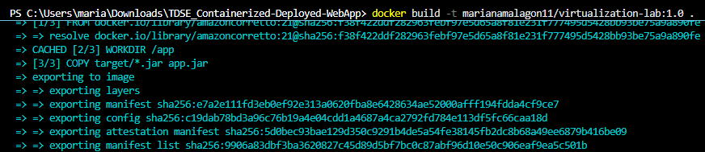

Verify the image was created:

```bash
docker images
```

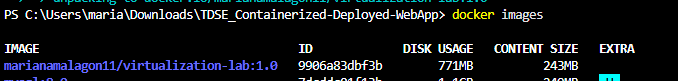

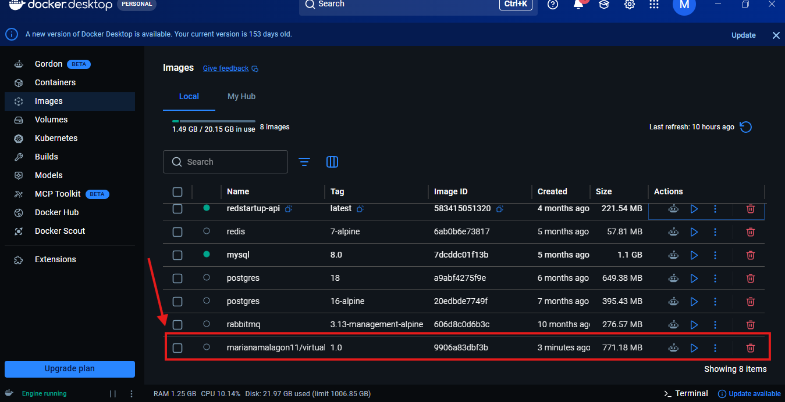

### Run a container

```bash
docker run -d --name virtualization-lab-1 -e PORT=6000 -p 34000:6000 marianamalagon11/virtualization-lab:1.0
```

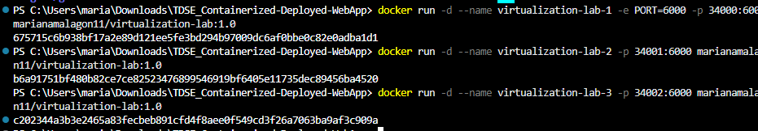

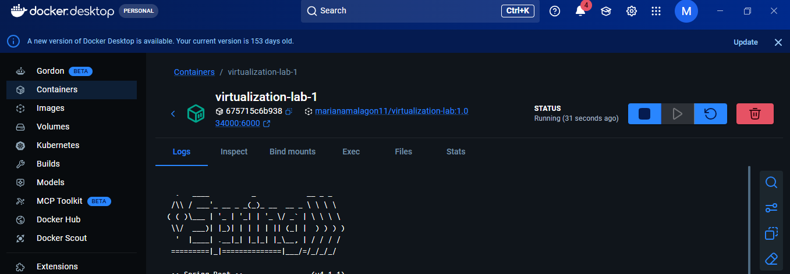

The container maps host port `34000` to the container's internal port `6000`, and its logs confirm Spring Boot started successfully.

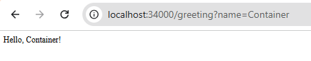

### Demonstrating container isolation

Two additional containers were started from the same image on different host ports. They run independently of each other and of `virtualization-lab-1`, proving that Docker gives each instance its own isolated process and network space on the same host:

```bash
docker run -d --name virtualization-lab-2 -p 34001:6000 marianamalagon11/virtualization-lab:1.0
docker run -d --name virtualization-lab-3 -p 34002:6000 marianamalagon11/virtualization-lab:1.0
```


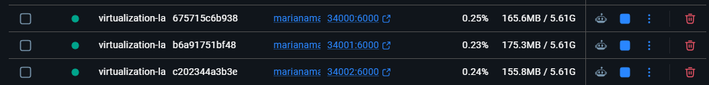

Each container was verified independently and responded with its own name parameter, confirming they are fully isolated instances:

```
http://localhost:34000/greeting?name=Container   -> Hello, Container!
http://localhost:34001/greeting?name=Container2  -> Hello, Container2!
http://localhost:34002/greeting?name=Container3  -> Hello, Container3!
```

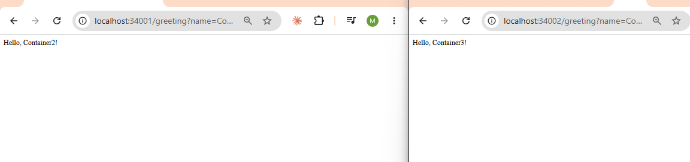

## Part 3: Multi-container environment with Docker Compose

Docker Compose defines and runs the application environment with two services on the same Docker network: the Spring Boot app (`web`) and a MongoDB database (`db`). The application does not persist data in MongoDB yet. The `db` service exists to show how Compose manages multiple services, networking, port mappings, and persistent volumes (see [compose.yaml](compose.yaml)).

The `web` service is built from the local `Dockerfile`, and the `db` service uses the official `mongo:8` image. The `web` container can reach MongoDB through the hostname `db`, which is the Compose service name, since Compose creates the internal network automatically. Two named volumes (`mongodb`, `mongodb_config`) preserve MongoDB's data independently of the container lifecycle.

### Build and start both services

```bash
docker compose up -d --build
```

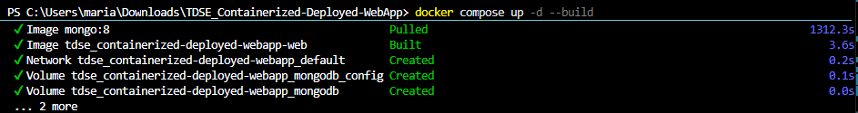

### Verify both containers are running

```bash
docker compose ps
```

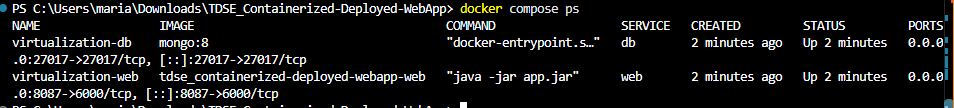

### Inspect the logs

```bash
docker compose logs web
```

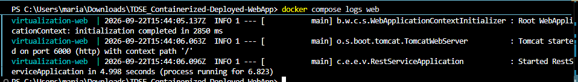

```bash
docker compose logs db
```

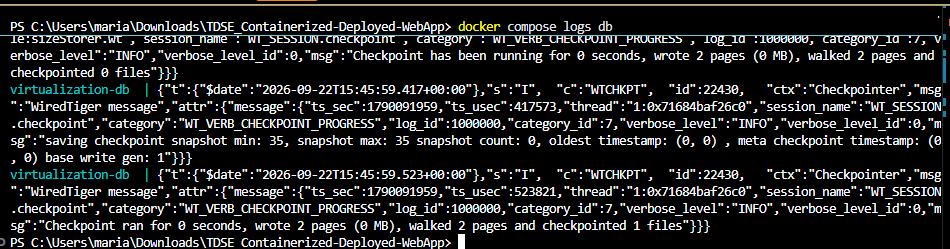

### Verify the web application

```
http://localhost:8087/greeting?name=Compose
```

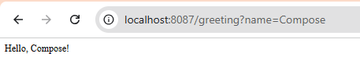

### Connect to MongoDB directly

To confirm the `db` service works independently of the application, connect to its shell and run a few basic operations:

```bash
docker compose exec db mongosh
```

```
show dbs
use workshop
db.messages.insertOne({ message: "Hello from Docker Compose" })
db.messages.find()
exit
```

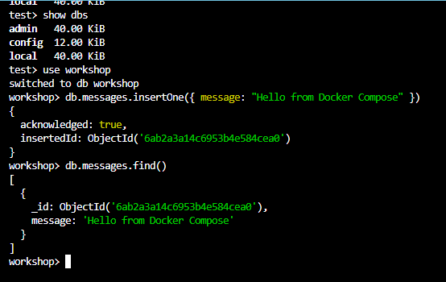

The document was inserted and retrieved successfully, confirming that MongoDB is running and reachable inside its own container.

### Stopping the environment

```bash
docker compose down      # stops and removes containers, keeps the volumes (data is preserved)
docker compose down -v   # also removes the volumes (all MongoDB data is deleted)
```

## Part 4: Publish to Docker Hub

**Docker Hub repository:** [hub.docker.com/r/marianamalagon11/virtualization-lab](https://hub.docker.com/r/marianamalagon11/virtualization-lab)

Log in, tag the image as `latest` in addition to `1.0`, and push both tags:

```bash
docker login
docker tag marianamalagon11/virtualization-lab:1.0 marianamalagon11/virtualization-lab:latest
docker push marianamalagon11/virtualization-lab:1.0
docker push marianamalagon11/virtualization-lab:latest
```

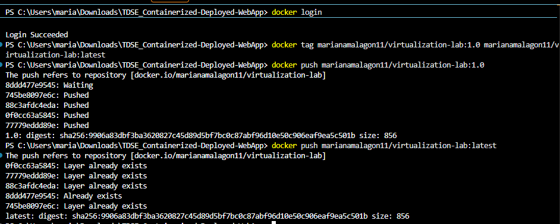

The repository appears under the account with both tags:

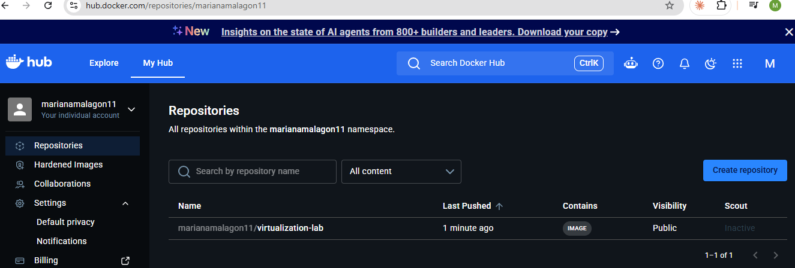

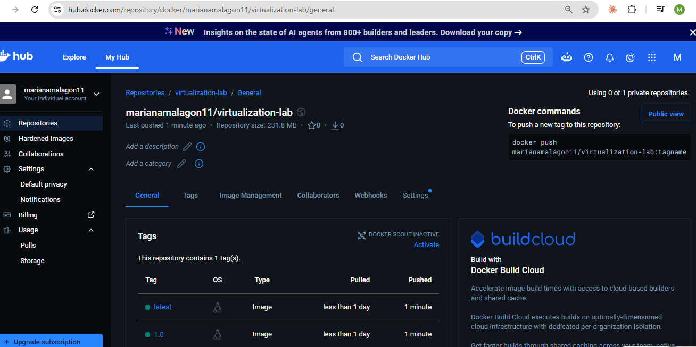
